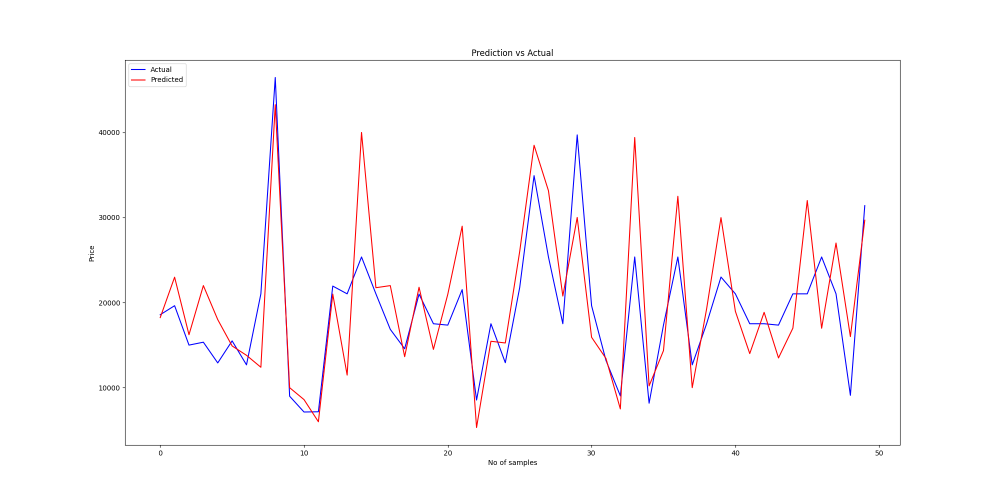

# Model for predicting the Car Price.

As said, all the required libraries were listed in the requirements.txt

Running the following command will download all the python imports

```console
    pip install -r requirements.txt
```

1) Explaining of the code.
    * Preprocessed the data to check null values, duplicaties. 
    * Found categorical data in the dataset. Therefore using one-encoding I have converted the dataset to the required form for training using a Decision Tree.
    * I have used decision tree regressor machine learning algorithm to predict the prices of the cars.
    * Here is a graph depicting the actual values and predicted values.
    * After observing different values of depth, I have choosen the depth of 40 for the decision tree.
    * 

2) How to run the code.
    * Run the following command to run the code.
    ```console
        python submission.py
    ```
    * NOTE: The code will take some time to run as it is training the model and predicting the values.
    * The graph of actual v/s predicted values is plotted and shown in the images folder.
    * The rms Values will be printed in the console.
    * The predicted values will be stored in the file named "predicted_values.csv" in the data folder.
